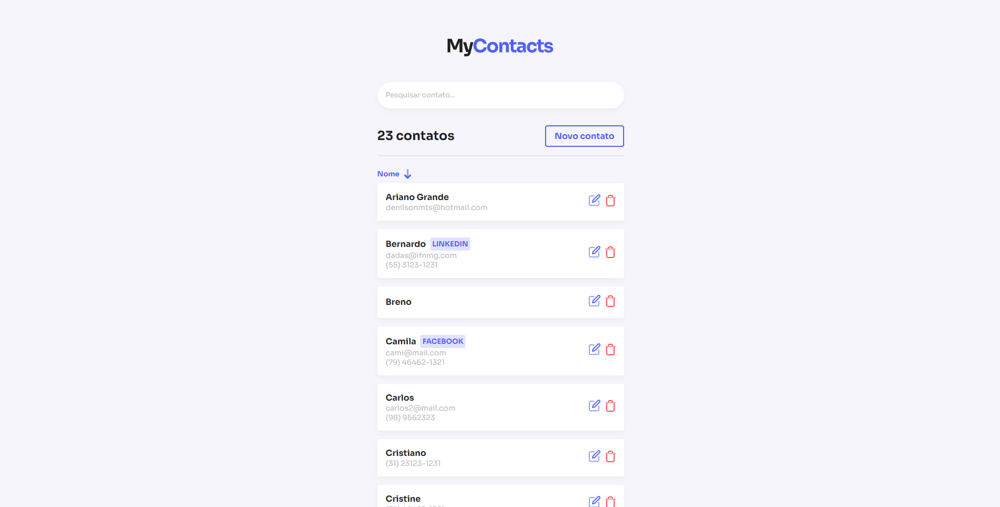

<p align="center">
    
</p>

| MyContacts é um aplicativo para gerenciar contatos

<p align="center">
    
</p>

## 💻 Tecnologias utilizadas
- ReactJS
- React Hooks
## 🚀 Iniciando

Clone o projeto e acesse a pasta

```bash
$ git clone https://github.com/DenilsonMelo/mycontacts-fe.git && cd mycontacts-fe
```

Siga os demais passos

```bash
# Instale as dependências
$ yarn

# Execute o projeto
$ yarn start
```

Abra [http://localhost:3000](http://localhost:3000) em seu browser preferido para ver o resultado.

ATENÇÃO: Para uma melhor experiência deve ser feito o clone do repositório da [API](https://github.com/DenilsonMelo/mycontacts-api) para ser executada em paralelo.
